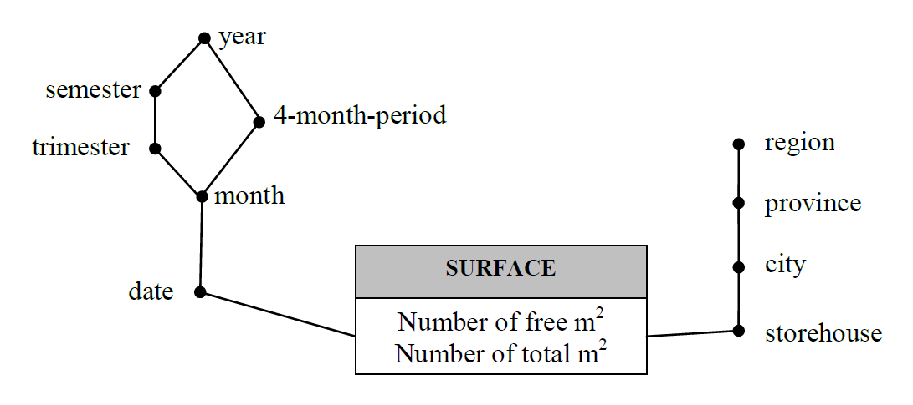

# Italian Household Appliance Data Warehouse Design

## Conceptual Design

## Logical Design

Primary Keys are underlined.

### Fact Tables

**SURFACE** (<u>storehouseID</u>, <u>timeID</u>, m2free, m2tot)
**PRODUCTS** (<u>storehouseID</u>, <u>timeID</u>, <u>typeID</u>, totNumber, totValue)

### Dimension Tables

**TIME** (<u>timeID</u>, date, month, trimester, 4month-period, semester, year)

**TYPES** (<u>typeID</u>, type, category)

**STOREHOUSES** (<u>storehouseID</u>, storehouse, city, province, region)

## Queries

**Query 1:** In the first trimester of 2003, regarding the storehouses in Turin, select the total value of the products stored in each storehouse at any given date, and select the average daily total value of the products in each storehouse during the previous week (including the current date).

    select storehouse, date, sum(totValue),
    avg( sum(totValue) ) over (partition by storehouse order by date range between interval ‘6’ day preceding and current row)
    from
    products p, storehouses sh, time t
    where
    p.storehouseID=sh.storehouseID and p.timeID=t.timeID and t.trimester=1/2003 and sh.city=’Turin’
    group by 
    storehouseID, storehouse, date;

**Query 2:** In 2004, for each city and date, select the percentage of daily free surface of the storehouses. Give a rank to the results (rank 1 is the lowest percentage).

    select city, date, sum(m2free)/sum(m2tot)*100,
    rank() over (order by sum(m2free)/sum(m2tot) asc)
    from
    surface s, storehouses sh, time t
    where
    s.storehouseID=sh.storehouseID and s.timeID=t.timeID and t.year=2004
    group by
    city, date;

**Query 3:** In the first 6 months of 2004, select the percentage of free surface for each storehouse and date.

    select
    storehouse, date, (m2free/m2tot)*100,
    from
    products p, storehouses sh, time t
    where
    p.storehouseID=sh.storehouseID and p.timeID=t.timeID and
    t.month>=1/2004 and t.month<=6/2004
    group by
    storehouseID, storehouse, date;

**Query 4:** In 2003, select the average daily total value of products for each storehouse and month.

    select
    storehouse, month, sum(totValue)/count(distinct date)
    from products p, storehouses sh, time t
    where
    p.storehouseID=sh.storehouseID and p.timeID=t.timeID and t.year=2003
    group by
    storehouseID, storehouse, month;

Alternatively,

    select distinct
    storehouse, month,
    avg( sum(totValue) ) over (partition by storehouse, month)
    from
    products p, storehouses sh, time t
    where
    p.storehouseID=sh.storehouseID and p.timeID=t.timeID and t.year=2003
    group by
    storehouseID, storehouse, date, month;

**Query 5:** In 2003, select the average daily total value of products for each region.

    select
    region, sum(totValue)/count(distinct date)
    from 
    products p, storehouses sh, time t
    where
    p.storehouseID=sh.storehouseID and p.timeID=t.timeID and t.year=2003
    group by
    region;

Alternatively,

    select distinct
    region, avg(sum(totValue)) over (partition by region)
    from 
    products p, storehouses sh, time t
    where
    p.storehouseID=sh.storehouseID and p.timeID=t.timeID and t.year=2003
    group by
    region, date;

**Query 6:** In 2004, select the average percentage of daily free surface for each month and region.

    select distinct
    region, month,
    avg(sum(m2free)/sum(m2tot)*100) over (partition by region, month)
    from 
    surface s, storehouses sh, time t
    where
    s.storehouseID=sh.storehouseID and s.timeID=t.timeID and t.year=2004
    group by
    region, month, date;

